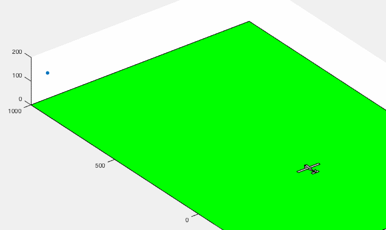
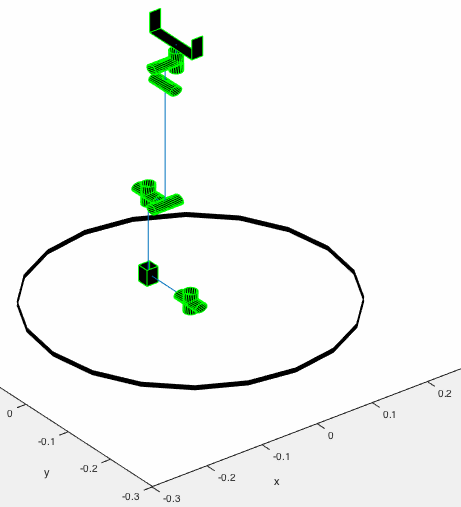

--- 
layout: default
title: "Arkiv"
---

# Arkiv

Fra min første hjemmeside/blog som jeg skrev da jeg fortsatt var student. Trodde jeg skulle skrive mye blog da, men gjorde ikke det. Blir sikkert ikke så mye mer denne gangen. Teksten er så klein, så jeg tør ikke lime inn direkte. Det første jeg gjorde var å simulere et lite modellfly som følger etter en ball i luften.

Jeg hadde nettopp lært meg om autopiloter i faget fartøystyring og fra en av bøkene i kurset. Det er en full fysikksimulering med aerodynamikk og stivt-legeme-dynamikk (finnes det et bedre navn?) og vær og vind.

Mitt andre blogginnlegg handlet om noe jeg hadde lurt på lenge. Du vet når roboter flytter på albuen uten å flytte på hånda? Unaturlig for mennesker, men roboter gjør det ofte. Jeg hadde alltid lurt på hvordan man beregner dette. Her er en simulering jeg gjorde:

Hvordan får man dette til? Det har med invers av avlange matriser å gjøre. Altså matriser som egentlig ikke er inverterbare. Man lærer jo så mye rart på skolen. At man ikke skal dele på null, at man ikke kan invertere avlange matriser, at linearisering er lurt, at det ikke finnes [integratorer for annengradslikninger](symplektisk.html). Og når professorer sier sånne ting, da må man undersøke. Og da finner man ut hvordan robotarmer kan vri på albuen uten å vri på hånda.