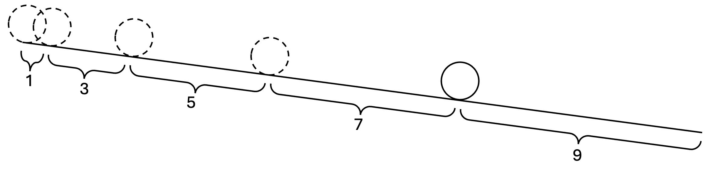
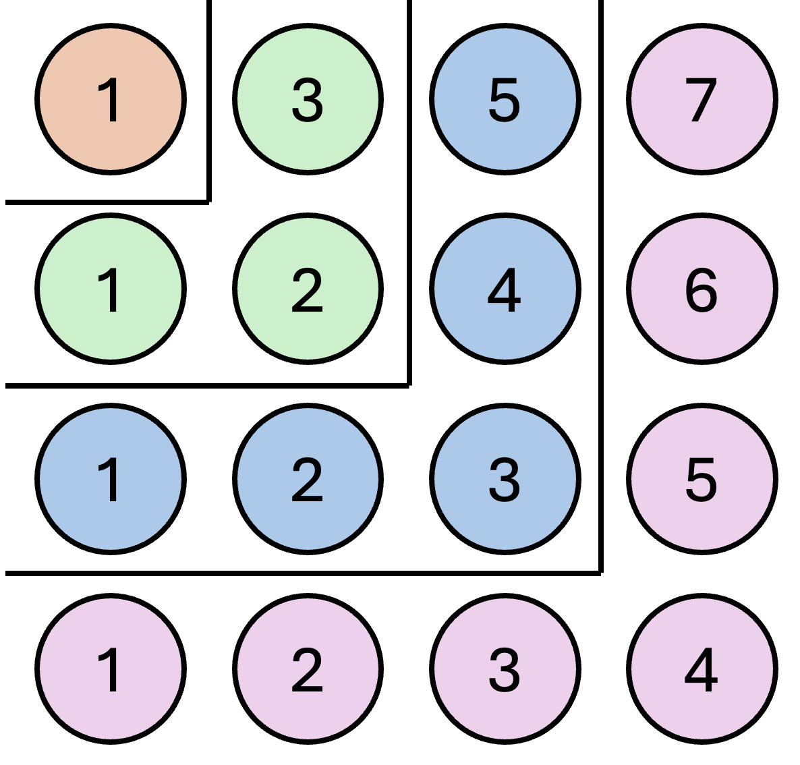
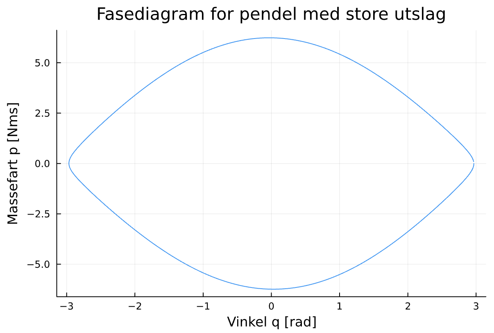

# Galileo, oddetallene, og elliptiske integral

Galileo fant en merkelig sammenheng mellom oddetallene og akselerasjonen til rullende kuler

[](img/rullendeplan.png)

Alle tidsintervallene var et oddetall! (på formen $o=2n+1:n\in \mathbb{N}$ for de som liker notasjon) Det høres rart ut. Kan naturen telle? Og hvorfor valgte ikke gud heller de pene partallene? Selvfølgelig fordi den akkumulerte strekningen er proposjonal med $t^2$ som i $x(t) = at^2$. Eller summen av oddetallene er et kvadrat:

[](img/sumavoddetall.png)

Galileo hadde ikke klokke, så han brukte først pulsen sin. Men den var så ustabil, så han begynte å bruke en pendel. Men pendelen måtte ha små utslag, for på store utslag, ble også den perioden ustabil.

Jeg ble nysgjerrig. Hva er perioden i de større utslagene? På skolen har vi alltid linearisert likningen for pendelen 

$$l\ddot{\phi}+g\cos \phi=0$$

med små vinkler, for da er $\sin \phi \approx \phi$.

Men Galileo begynte jo med store vinkler. Jeg fikk en ide om å beregne perioden ved å integrere en runde i fasediagrammet. Beregne lengden til en strømlinje. Dette begynner å lukte av symplektisk geometri, som jeg har lyst til å lære mer om senere. Uansett. Likningene som beskriver strømlinjene er

$$
\begin{align}
\dot{p}&=-\frac{\partial H}{\partial q}\\
\dot{q}&=\frac{\partial H}{\partial p}
\end{align}
$$

Hvor $H$ er total energi, og $p$ og $q$ er henholdsvis massefarten og posisjonen til systemet i faserommet. Heldigvis er dette et todimensjonalt system, så det blir lett å visualisere.

Energien er

$$
H(p,q)=\frac{1}{2ml^{2}}p^{2}-mlg\cos q
$$

slik at strømlinjene kan beregnes med

$$
\begin{align}
\dot{p}&=-mlg\sin q\\
\dot{q}&=\frac{p}{ml^{2}}
\end{align}
$$

Jeg kjørte dette i Julia og plottet en strømlinje:

[](img/pendelfasediagram.png)

Julia har noen pakker, feks ``DiffEqPhysics.jl``, som gjør at man kan integrere hamiltonske systemer direkte, og benytte seg av den symplektiske geometrien til systemet for gunstigere energibevaring osv.

Her er den totale energien
```julia
function Pendulum_Hamiltonian(p, q, parameters, time)
	m,l,g = parameters
	1/(2m*l^2)*p^2 - m*l*g*cos(q)
end
```

Og så defineres problemet
```julia
prob = HamiltonianProblem(Pendulum_Hamiltonian, p0, q0, tspan, parameters)
```
Og integreres numerisk med en symplektisk integrator og med en callback som gjør at integratoren stopper etter en runde i fasediagrammet

```julia
solution = solve(prob, SymplecticEuler(), dt=0.01, callback=Callback_pendulum)
```
Det var mye trøbbel for å beregne perioden. I gamledager hadde de ikke Julia og heller ikke symplektiske integratorer, men de klarte å beregne perioden analytisk... med elliptiske integral! Hvorfor har vi ikke lært dette på skolen? Andrew Wiles brukte elliptiske kurver til å bevise fermats siste teorem, men jeg vet ikke om det er relatert.

$$\int_{0}^{2\pi}\frac{d\theta}{\sqrt{1-k^{2}\sin^{2}\theta}}$$