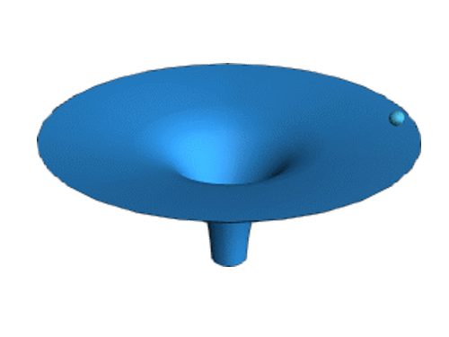

# Velkommen til Sindre's Research Extravaganza!

Jeg heter Sindre, og her er min hjemmeside hvor jeg tenker å kladde ned sporadiske tekster med interessante tanker. Jeg tror temaet kommer til å være fysikk og matematikkrelatert, men jeg har mange dype interesser, så kanskje det blir et og annet sidespor også. Hovedmålet i denne delen av interessesfæren er å lære meg Einsteins generelle relativitetsteori. Jeg har alltid vært interessert i mekanikk og geometri, og på NTNU fikk jeg ikke helt nok, så jeg har lest litt rundt og det virker som det er en meget dyp kopling mellom nettopp disse to fagfeltene. I noen av fagene jeg hadde; robotdynamikk, ulineære systemer og kaos (Strogatz <3), dynamiske mekaniske systemer, luktet vi på noen av disse sammenhengene, men vi skrapte bare på overflaten. Jeg kommer til å bruke lang tid, men hvis jeg blir inspirert, kanskje den blir kortere. Jeg skal prøve å legge listen litt lavt og slurve litt og ikke bruke KI.

- [ Torsjonsvibrasjoner, stive likninger, og symplektisk integrasjon](symplektisk.html)
- [ Galileo, oddetallene, og elliptiske integral](galileo.html)
- [ Bokbad](bokbad.html)
